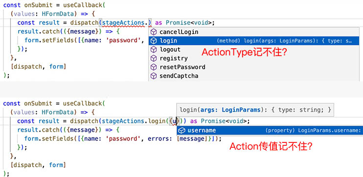
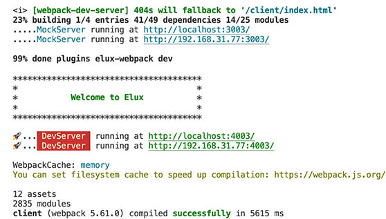

<div align="center">
    
    <h2> - <a href="https://eluxjs.com">eluxjs.com</a> -</h2>
    <h3>基于“微模块”和“模型驱动”的跨平台、跨框架『同构方案』</h3>
    <small style="background:#eee">支持React/Vue/Web(浏览器)/Micro(微前端)/SSR(服务器渲染)/MP(小程序)/APP(手机应用)</small>
</div>

# 项目介绍

本项目主要基于`Elux+Antd`构建，包含`React`版本和`Vue`版本，旨在提供给大家一个**简单**、**开箱即用**的后台管理系统通用模版，主要包含运行环境、脚手架、代码风格、基本Layout、状态管理、增删改查逻辑、列表、表单等。

> 为保持工程简单清爽，方便二次开发，不提供各种纷杂的具体业务组件（网上很多）

## 在线预览

<http://admin-react-antd.eluxjs.com>

## Git仓库

- React版本
  - github: <https://github.com/hiisea/elux-react-antd-admin>
  - gitee: <https://gitee.com/hiisea/elux-react-antd-admin-fork>
- Vue
  - github: <https://github.com/hiisea/elux-vue-antd-admin>
  - gitee: <https://gitee.com/hiisea/elux-vue-antd-admin-fork>

## 安装方法

- 使用Git命令clone相应的库：`git clone xxx`
- 也可以使用Elux提供的命令：`npm create elux@latest 或 yarn create elux`

## 你看得见的UI

- 虚拟Window
- 收藏书签
- 增删改查
- 跨页选取
- 资源选择器

## 你看不见的幕后

- 使用微模块架构，将业务功能封装成独立微模块，想要哪个功能就安装哪个模块，是一种粒度更细的微前端

  ```txt
   你以前的SRC长这样？？？
    │
    ├─ src
    │  ├─ api                 # API接口管理
    │  ├─ assets              # 静态资源文件
    │  ├─ components          # 全局组件
    │  ├─ config              # 全局配置项
    │  ├─ directives          # 全局指令文件
    │  ├─ enums               # 项目枚举
    │  ├─ hooks               # 常用 Hooks
    │  ├─ language            # 语言国际化
    │  ├─ layout              # 框架布局
    │  ├─ routers             # 路由管理
    │  ├─ store               # store
    │  ├─ styles              # 全局样式
    │  ├─ typings             # 全局 ts 声明
    │  ├─ utils               # 工具库
    │  ├─ views               # 项目所有页面
    │  ├─ App.vue             # 入口页面
    │  └─ main.ts             # 入口文件
  ```

   快来拯救你的SRC(^V^)，

  ```txt
  使用微模块后SRC长这样！！！
    │
    ├─ src
    │  ├─ moddules            # 各业务微模块
    │  │    ├─ user
    │  │    ├─ article        
    │  │    ├─ comment   
    │  ├─ Project.vue         # 各微模块聚合配置
    │  └─ index.ts            # 入口文件
  ```

  - 微模块支持同步/异步加载
  - 微模块支持本地目录、支持发布成NPM包，支持独立部署（微前端）
  - 微模块支持整体TS类型验证与提示
- 内置地表最强状态管理框架(^-^)：
  - 同时支持React/Vue，不再深度耦合UI框架。
  - 最大程度简化action和store的写法

  ```ts
  export class Model extends BaseMode {

    @reducer //类似Vuex的mutations
    public putCurUser(curUser: CurUser) {
      this.state.curUser = curUser; // vue中可直接修改
      //this.state = {...this.state, curUser} react中
    }

    @effect() //类似Vuex的action
    public async login(args: LoginParams) {
      const curUser = await api.login(args);
      this.dispatch(this.actions.putCurUser(curUser));
      this.getRouter().relaunch({url: AdminHomeUrl}, 'window');
    }
  }
  ```

  - 与路由结合，支持Store多实例。
  - 路由跳转时自动清空Store，再也不用担心State在Store中无限累积。
  - 为action引入线程机制，支持在处理action的过程中，在派生出新的action线程。
  - action执行中支持异步操作：

  ```ts
  @effect()
  public async updateItem(id: string, data: UpdateItem) {
    await this.api.updateItem!({id, data}); //调用后台API
    await this.getRouter().back(1, 'window'); //路由后退一步(到列表页)
    message.success('编辑成功！'); //提示
    this.getRouter().back(0, 'page'); //back(0)表示刷新当前页(列表页)
  }
  ```

  - 支持awiat action的执行结果，如：

  ```ts
  const onSubmit = (values: HFormData) => {
    const result = dispatch(stageActions.login(values));
    //stageActions.login()中包含异步请求，返回Promise

    result.catch(({message}) => {
      form.setFields([{name: 'password', errors: [message]}]);
    });
  };
  ```

  - 为action引入事件机制，dispatch一个action支持多处监听，共同协作完成一个长流程业务。例如：ModelA 和 ModelB 都想监听`用户切换`这个Action：

  ```ts
  // ModelA:
  export class ModelA extends BaseResource {
    @effect()
    public async ['stage.putCurUser'](user: User) {
      if (user.hasLogin) {
          this.dispath(this.actions.xxx());
      } else {
          this.dispath(this.actions.xxx());
      }
    }
  }

  // ModelB:
  export class ModelB extends BaseResource{
    @effect()
    public async ['stage.putCurUser'](user: User) {
      if (user.hasLogin) {
          this.dispath(this.actions.xxx());
      } else {
          this.dispath(this.actions.xxx());
      }
    }
  }
  ```

  - 路由跳转前会自动派发`stage._testRouteChange`的action，你可以监听它，阻止路由跳转：

  ```ts
  @effect(null)
  protected async ['this._testRouteChange']({url, pathname}) {
      if (!this.state.curUser.hasLogin && this.checkNeedsLogin(pathname)) {
          throw new CustomError(CommonErrorCode.unauthorized, '请登录！');
      }
  }
  ```

  - 支持catch action执行过程中的错误，并决定继续或终止当前action执行：

  ```ts
  @effect(null)
  protected async ['this._error'](error: CustomError) {
      if (error.code === CommonErrorCode.unauthorized) {
          this.getRouter().push({url: '/login'}, 'window');
      }else{
          alert(error.message);
      }
      throw error;
  }
  ```

  - 武装到牙齿的Typescript智能提示和自动补全（并且类型自动生成，无需手写）：
- 提供基于双栈单链的虚拟路由。
  - 拥有2维历史记录栈，将原生路由体验带入浏览器。

  ```ts
  router.push({url: '/login'}, 'page') //在当前页历史记录栈中新增一条历史记录
  router.push({url: '/login'}, 'window') //在新窗口历史记录栈中新增一条历史记录
  ```

  - 基于虚拟路由，不再直接关联原生路由，中间可以转换映射。如在小程序中映射：

  ```ts
  const NativePathnameMapping = {
    in(nativePathname) { //将小程序路由地址映射为虚拟路由地址
      if (nativePathname === '/') {
        nativePathname = '/modules/article/pages/list';
      }
      const Prefix = {my: '/admin'};
      return nativePathname.replace(/^\/modules\/(\w+)\/pages\//, (match, moduleName) => {
        return `${Prefix[moduleName] || ''}/${moduleName}/`;
      });
    },
    out(internalPathname) { //将虚拟路由地址映射为小程序路由地址
      internalPathname = internalPathname.replace('/admin/', '/');
      return internalPathname.replace(/^\/(\w+)\//, '/modules/$1/pages/');
    },
  }
  ```

  - 跨平台，可用于浏览器、服务器SSR、小程序、原生应用。
  - 跨框架，可用于React、Vue，不依赖其它路由框架，如react-router、vue-router
  - 可完整保存历史快照，包括Store和Dom元素
  - 可访问和查找历史记录，不再只是一个history.length

  ```ts
  const length = router.getHistoryLength(); //获取历史栈中的记录数
  const list = router.getHistory(); //获取所有历史记录
  const record = router.findRecordByStep(10); //获取10步之前的历史记录
  const record2 = router.findRecordByKey('8_1'); //获取编号为8_1的历史记录
  ```

    例如登录窗口中点击“取消登录”你需要回退到前一个页面，但此时如果前一个页面就是需要登录的页面，那么登录窗口又会被重新弹出。所以点击“取消登录”应当回退到最近的不需要登录的页面：

  ```ts
  @effect()
  public async cancelLogin(): Promise<void> {
    //在历史栈中找到第一条不需要登录的记录
    //如果简单的back(1)，前一个页面需要登录时会引起循环
    this.getRouter().back((record) => {
      return !this.checkNeedsLogin(record.location.pathname);
    }, 'window');
  }
  ```

  - 支持路由拦截和路由守卫
  - 可跟踪和等待路由跳转完成。例如修改用户后，需要返回列表页面并刷新：

  ```ts
  @effect()
  public async updateItem(id: string, data: UpdateItem) {
    await this.api.updateItem!({id, data});
    await this.getRouter().back(1, 'window'); //可await路由后退
    message.success('编辑成功！');
    this.getRouter().back(0, 'page'); //back(0)可刷新页面
  }
  ```

  - 提供更多路由跳转方法

  ```ts
  router.push(location, target); //新增
  router.replace(location, target); //替换
  router.relaunch(location, target); //重置
  router.back(stepOrCallback, target) //后退或刷新
  ```

- 提供与项目同构的本地MockServer，MockServer也使用Typescript，但无需再写类型文件，直接从`src/`下面与项目共享，支持修改自动重启。
- 🚀 开箱即用的脚手架。提供封装好的`Cli命令行`脚手架，不用自己折腾：
- 基本的`eslint/stylelint/babel`都已经帮你打包好了，不用安装各种插件和写一大堆依赖：

  ```json
  "devDependencies": {
    "@elux/babel-preset": "^1.0.2",
    "@elux/eslint-plugin": "^1.2.2",
    "@elux/stylelint-config": "^1.1.1"
  }
  ```

- 未完待续...
